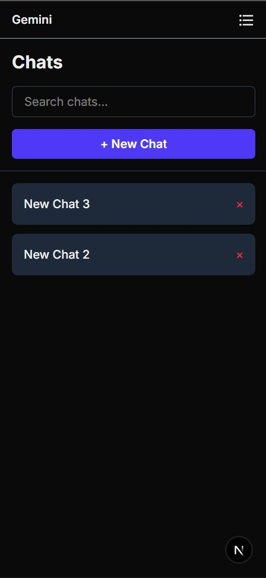
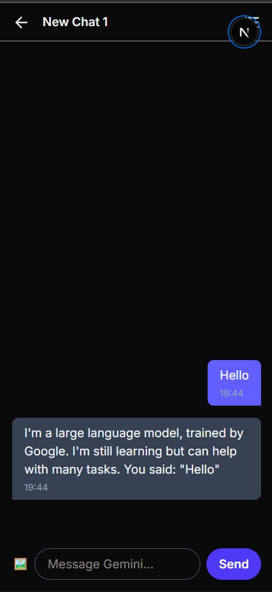
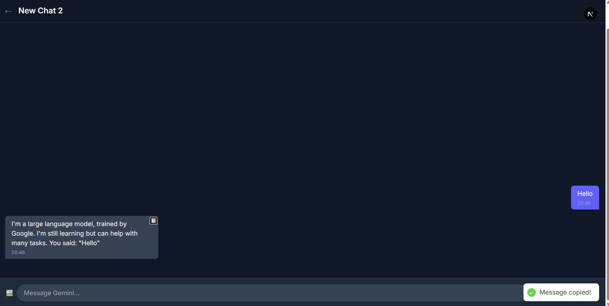

# Gemini Chat App

This project is a conversational AI chat application built to simulate a Gemini-style interface. It features a modern, responsive design and includes core functionalities like authentication, chat management, and a dynamic chat interface.

[Live Demo Link ([Gemini](https://geminiclonetask.vercel.app/))]

## Setup & Run Instructions

1.  **Clone the repository:**
    ```bash
    git clone(https://github.com/mdyasir1/gemini-clone.git)
    cd gemini-clone
    ```
2.  **Install dependencies:**
    ```bash
    npm install
    ```
3.  **Run the development server:**
    ```bash
    npm run dev
    ```
4.  Open [http://localhost:3000](http://localhost:3000) in your browser.

## Folder Structure

The project uses the new Next.js App Router.

-   `app/`: Contains the main application routes, including `(auth)` for login/signup and `(dashboard)` for the main chat interface.
-   `components/`: Reusable React components are organized by feature (e.g., `auth`, `dashboard`, `ui`, `chat`).
-   `hooks/`: Custom hooks for reusable logic, such as debouncing and infinite scroll.
-   `store/`: Zustand stores for global state management (`authStore`, `chatStore`).
-   `utils/`: Helper functions, types, and Zod schemas.

## Implementation Notes

### Throttling
Throttling is implemented via a `throttle` helper function in `utils/helpers.ts`. Although not explicitly used in the final UI logic (as `setTimeout` and `useDebounce` are sufficient for this assignment), it's included as a core utility a developer might build.

### Pagination & Infinite Scroll
-   **Client-side pagination** is handled in `components/chat/MessageList.tsx` using a custom `useInfiniteScroll` hook.
-   The hook manages the number of messages to display, starting with the last 20 and loading more as the user scrolls up.
-   The `loadingRef` is a `ref` attached to a placeholder element, and an `IntersectionObserver` is used to detect when this element comes into view, triggering the loading of older messages.

### Validation
-   **Form validation** is implemented with `React Hook Form` and `Zod`.
-   The validation schemas are defined in `utils/schemas.ts`.
-   This ensures that inputs like phone numbers and OTPs adhere to specific formats before submission.

### Deployment
This project is deployment-ready for platforms like Vercel. Simply connect your repository and Vercel will handle the rest.

## Screenshots

### Dark Theme


### Light Theme


### Responsive Design


### Chat Interface
